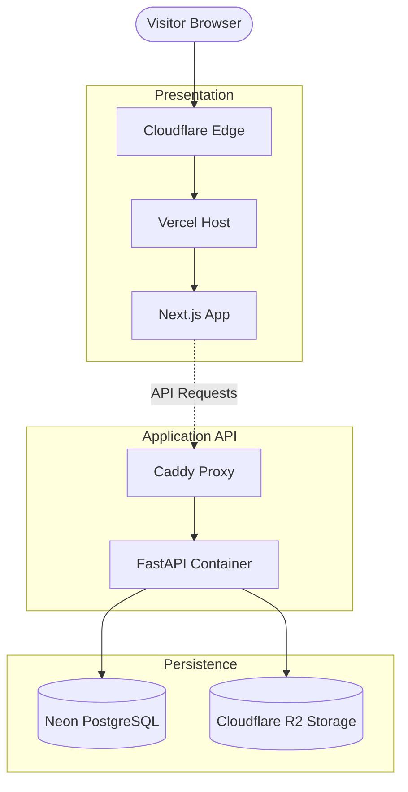

# Mansoor Syed — Portfolio & CMS

This is the source code for my personal portfolio, blog, and custom CMS. It is currently live at [mansoorsyed.com](https://mansoorsyed.com).

## System Architecture

This project is built using a modern, decoupled architecture designed for high performance, edge delivery, and a custom writing experience.

### 1. Frontend
* **Framework:** Next.js 14+ (App Router)
* **Styling:** Tailwind CSS + Framer Motion
* **Hosting:** Vercel (Edge Network)
* **Features:** Statically generated pages (SSG) with Incremental Static Regeneration (ISR). Uses a custom MDX parser to embed interactive React components directly into blog posts.

### 2. Backend & API
* **Framework:** FastAPI (Python) running on Uvicorn
* **Database:** PostgreSQL hosted on Neon, accessed via async SQLAlchemy (`asyncpg`)
* **Infrastructure:** Dockerized and hosted on an Oracle Cloud Ubuntu Server.
* **Proxy & DNS:** Cloudflare handles edge TLS and proxying, routing traffic to a Caddy reverse proxy on the Oracle server.

### 3. Services & Integrations
* **Media Storage:** Cloudflare R2 (S3-compatible) stores all uploaded images and assets to keep the database lightweight.
* **Authentication:** Firebase Admin SDK secures the CMS. Only authorized admins verified via JWT can mutate content.
* **AI Integration:** Groq API (Llama 70B) powers a custom AI toolbar in the CMS for drafting assistance and Mermaid.js diagram generation.

## Request Flow

---
*Designed and built by [Mansoor Syed](https://www.linkedin.com/in/mansoor-syed-8373b3247/).*
